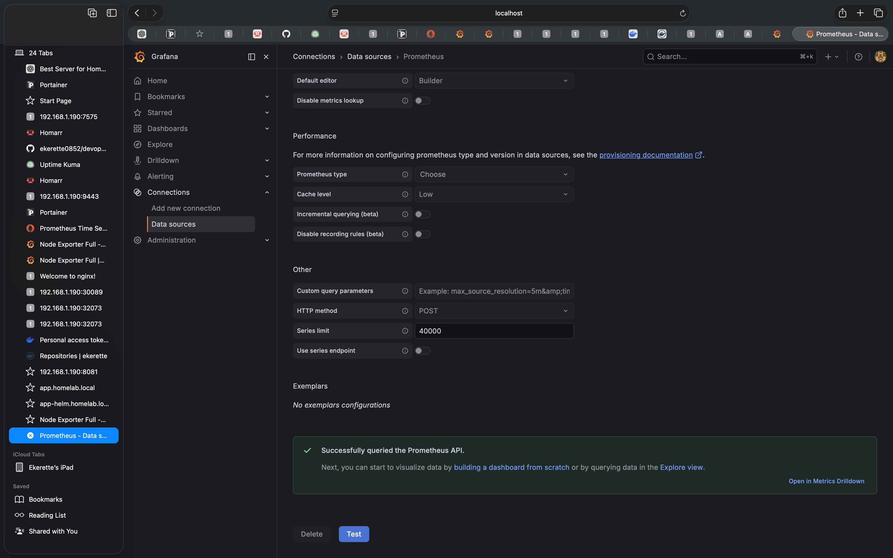
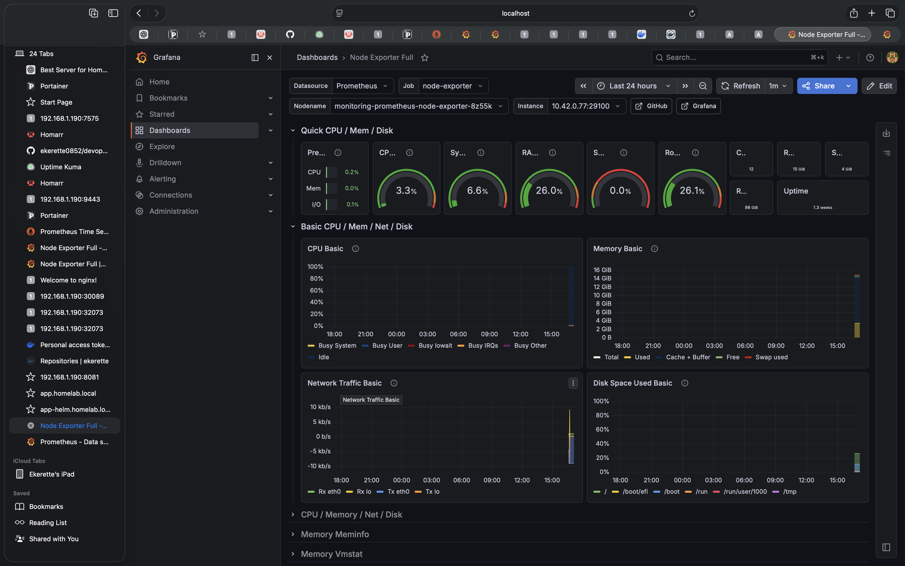

# Grafana Dashboard Setup

## Overview

Grafana was deployed as part of the kube-prometheus-stack Helm chart and configured to visualize Prometheus metrics collected from the Kubernetes cluster.

The dashboard provides real-time visibility into infrastructure performance including CPU, memory, disk, and network utilization.

---

## Objectives

* Connect Grafana to Prometheus
* Validate datasource connectivity
* Import monitoring dashboards
* Visualize infrastructure metrics
* Monitor cluster health

---

## Accessing Grafana

Port forward Grafana service:

```bash
kubectl port-forward -n monitoring svc/monitoring-grafana 3000:80
```

Open:

http://localhost:3000

---

## Data Source Configuration

Prometheus was configured as the primary datasource.

Connection validated successfully.

Verification message:

"Successfully queried the Prometheus API."

---

## Dashboard Import

Imported Dashboard:

Node Exporter Full

Dashboard ID:

1860

Imported from:

grafana.com

---

## Metrics Visualized

### CPU

* CPU utilization
* System CPU
* User CPU
* Idle CPU

### Memory

* Total memory
* Used memory
* Free memory
* Cache and buffers

### Disk

* Disk utilization
* Filesystem usage
* Available storage

### Network

* Network traffic
* Receive throughput
* Transmit throughput

---

## Validation

Prometheus query tested:

```promql
up
```

Results confirmed:

* Prometheus healthy
* Node Exporter healthy
* Kubernetes monitoring operational

---

# Grafana Monitoring

## Overview

Grafana was deployed as part of the kube-prometheus-stack and configured to visualize metrics collected by Prometheus.

---

## Data Source Configuration

Grafana was configured to use Prometheus as the primary data source.



Status: Connected

---

## Node Exporter Dashboard

Imported the Node Exporter Full dashboard to visualize infrastructure metrics.



Metrics available:

- CPU Usage
- Memory Usage
- Disk Utilization
- Network Traffic
- System Load
- Uptime

---

## Monitoring Validation

Verified successful visualization of:

- CPU metrics
- Memory metrics
- Disk metrics
- Network metrics

Status: Healthy

---

## Outcome

Successfully built a Kubernetes monitoring stack using:

- Prometheus
- Grafana
- Node Exporter
- kube-prometheus-stack

This provides real-time observability into cluster and node performance.

---

## Troubleshooting

### Issue

Dashboard initially displayed:

"No Data"

### Root Cause

Prometheus datasource was not fully validated.

### Resolution

* Verified Prometheus targets
* Tested datasource connection
* Confirmed successful API query
* Reloaded dashboard

Dashboard metrics populated successfully.

---

## Skills Demonstrated

* Grafana administration
* Dashboard configuration
* Prometheus integration
* Infrastructure visualization
* Monitoring troubleshooting
* Kubernetes observability

---

## Screenshots

See:

monitoring/screenshots/

