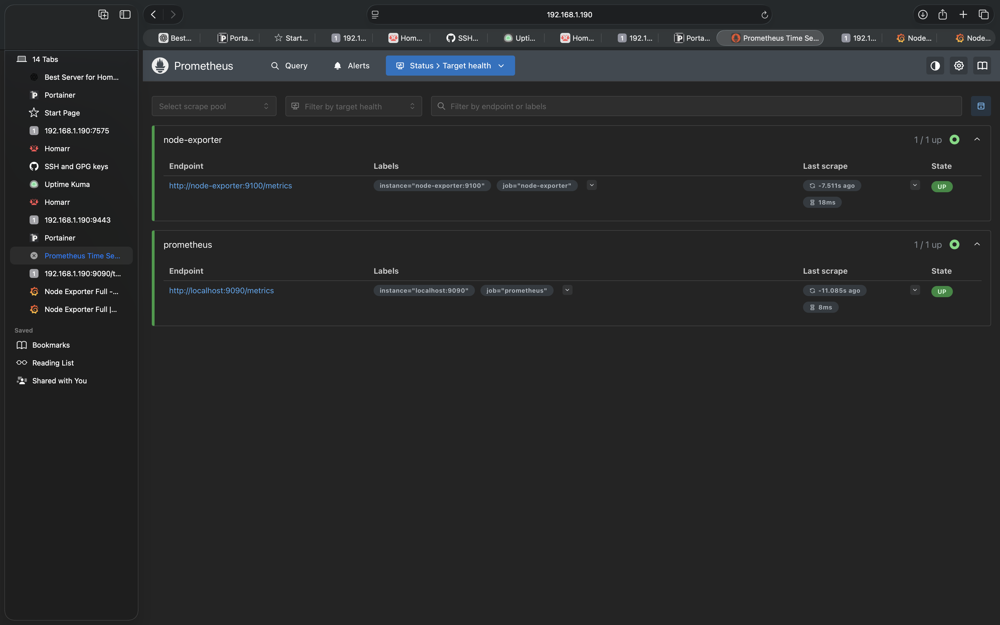

# Prometheus Monitoring Setup

## Overview

This project implements Prometheus as the monitoring solution for my Kubernetes homelab environment.

Prometheus was deployed using the kube-prometheus-stack Helm chart and configured to collect metrics from Kubernetes components and Node Exporter.

---

## Objectives

* Deploy Prometheus on Kubernetes
* Collect infrastructure metrics
* Monitor CPU, memory, disk, and network usage
* Validate metric collection
* Integrate with Grafana dashboards

---

## Environment

| Component     | Version               |
| ------------- | --------------------- |
| Ubuntu Server | 24.04                 |
| Kubernetes    | Rancher Desktop       |
| Helm          | v3                    |
| Prometheus    | kube-prometheus-stack |
| Grafana       | kube-prometheus-stack |
| Node Exporter | kube-prometheus-stack |

---

## Deployment

### Add Helm Repository

```bash
helm repo add prometheus-community https://prometheus-community.github.io/helm-charts
helm repo update
```

### Install kube-prometheus-stack

```bash
helm install monitoring prometheus-community/kube-prometheus-stack \
  --namespace monitoring \
  --create-namespace
```

---

## Verification

### Verify Pods

```bash
kubectl get pods -n monitoring
```

Expected components:

* Prometheus
* Grafana
* Alertmanager
* Node Exporter
* kube-state-metrics

---

### Verify Services

```bash
kubectl get svc -n monitoring
```

---

### Access Prometheus

```bash
kubectl port-forward -n monitoring svc/monitoring-kube-prometheus-prometheus 9090:9090
```

Access:

http://localhost:9090

---

## Targets Validation

Prometheus targets were verified through:

Status → Targets

All critical targets reported:

* UP
* Healthy
* Scraping successfully

Verified targets included:

* kube-state-metrics
* node-exporter
* kubelet
* prometheus
* alertmanager


# Prometheus Monitoring

## Targets

Prometheus successfully discovered and scraped monitoring targets.



## Metrics Collection

Verified collection of metrics from:

- Prometheus
- Node Exporter

Status: Healthy
---

## Node Exporter Troubleshooting

### Issue

Node Exporter metrics were not initially visible inside Grafana.

### Root Cause

Port forwarding was configured to an incorrect service port.

### Resolution

Verified service configuration:

```bash
kubectl get svc -n monitoring
```

Established a valid port-forward connection:

```bash
kubectl port-forward -n monitoring svc/monitoring-prometheus-node-exporter 29100:9100
```

Validated metrics collection:

```bash
curl http://localhost:29100/metrics
```

Metrics successfully returned.

---

## Metrics Validation

Validated metric collection using:

```promql
up
```

Results confirmed:

* Prometheus operational
* Node Exporter operational
* Kubernetes targets operational

---

## Skills Demonstrated

* Kubernetes administration
* Helm deployments
* Prometheus monitoring
* Infrastructure observability
* Linux troubleshooting
* Metrics validation
* Port forwarding
* Production-style monitoring setup

---

## Screenshots

See:

monitoring/screenshots/

