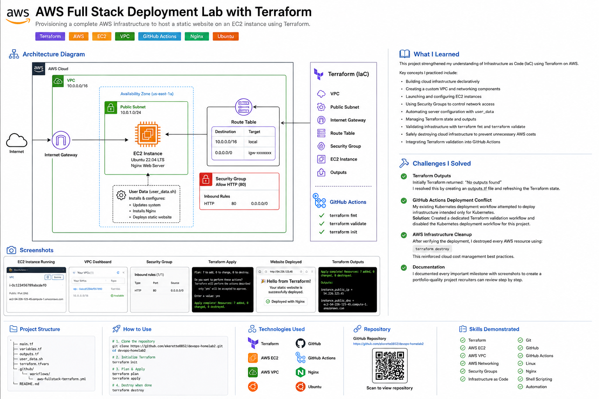
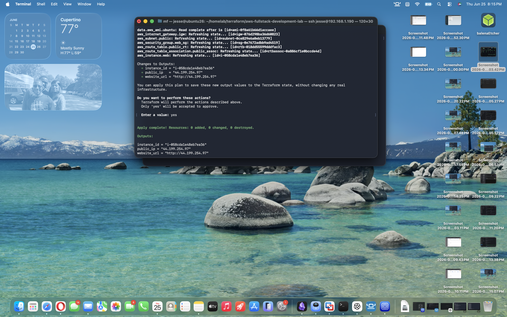
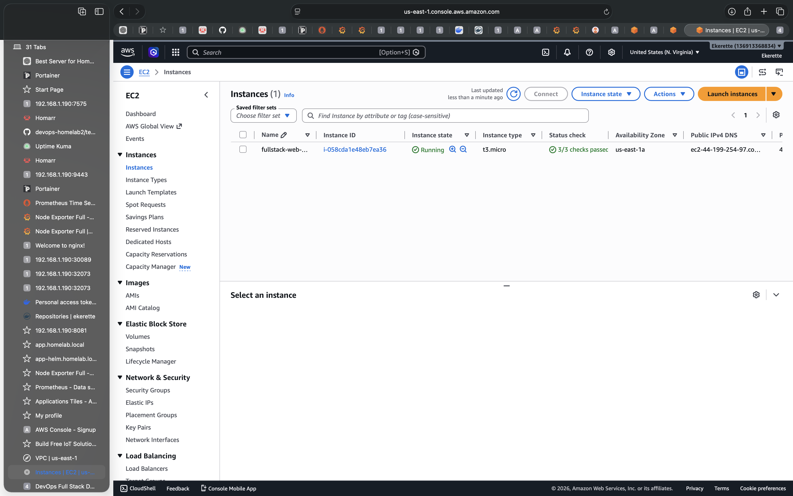
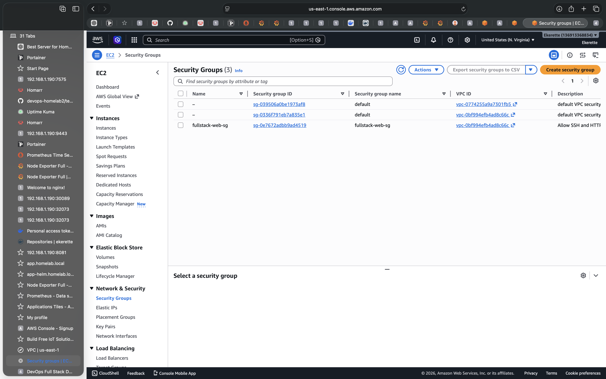
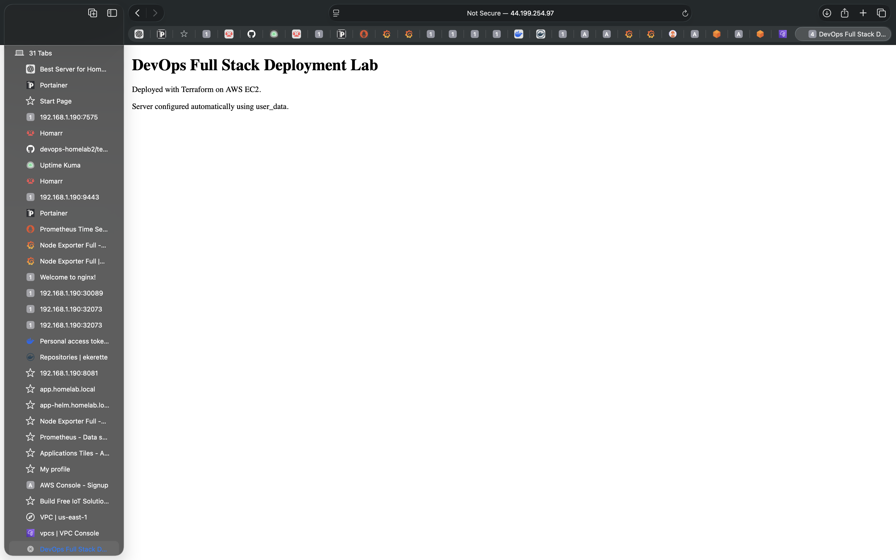
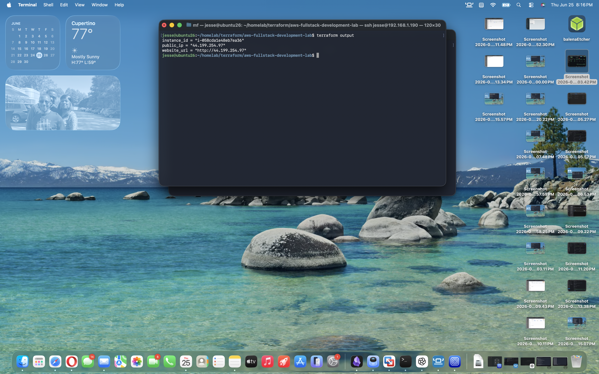

# AWS Full Stack Deployment Lab

## Objective
Deploy a public web application on AWS using Terraform, EC2, Docker, Nginx, and user_data automation.

## Architecture Diagram



## What I Learned

This project strengthened my understanding of Infrastructure as Code (IaC) using Terraform on AWS.

Key concepts I practiced include:

- Building cloud infrastructure declaratively
- Creating a custom VPC and networking components
- Launching and configuring EC2 instances
- Using Security Groups to control network access
- Automating server configuration with user_data
- Managing Terraform state and outputs
- Validating infrastructure with terraform fmt and terraform validate
- Safely destroying cloud infrastructure to prevent unnecessary AWS costs
- Integrating Terraform validation into GitHub Actions

## Challenges I Solved

During this lab I encountered several real-world issues and resolved them through troubleshooting.

### Terraform Outputs

Initially Terraform returned:

"No outputs found"

I resolved this by creating an outputs.tf file and refreshing the Terraform state.

---

### GitHub Actions Deployment Conflict

My existing Kubernetes deployment workflow attempted to deploy infrastructure intended only for Kubernetes.

Solution:

- Created a dedicated Terraform validation workflow
- Disabled the Kubernetes deployment workflow for this project

---

### AWS Infrastructure Cleanup

After verifying the deployment, I destroyed every AWS resource using:

terraform destroy

This reinforced cloud cost management best practices.

---

### Documentation

I documented every important milestone with screenshots to create a portfolio-quality project recruiters can review step by step.

## Infrastructure Created
- VPC
- Public Subnet
- Internet Gateway
- Route Table
- Security Group
- EC2 Instance
- Docker
- Nginx

## Verification
- Terraform initialized successfully
- Terraform validated successfully
- EC2 instance running in AWS
- Website accessible publicly at Terraform output URL

## Terraform Outputs
- Instance ID
- Public IP
- Website URL

## Cleanup
```bash
terraform destroy


## Screenshots

### Terraform Apply



---

### EC2 Instance



---

### VPC


---

### Security Group



---

### Application



---

### Terraform Outputs



## Skills Demonstrated

- Terraform
- AWS EC2
- AWS VPC
- AWS Networking
- Security Groups
- Infrastructure as Code
- Git
- GitHub
- GitHub Actions
- Linux
- Nginx
- Shell Scripting
- Automation
