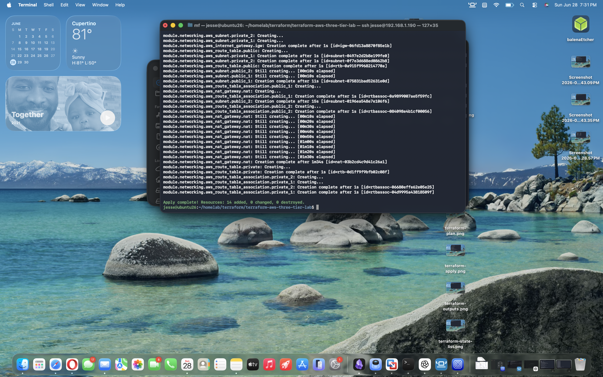
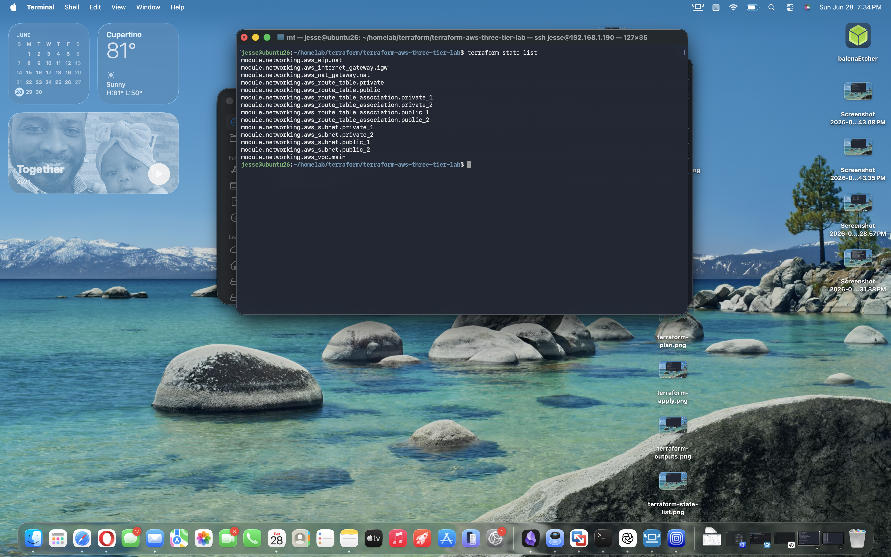

# Terraform AWS Three-Tier Architecture Lab

This project demonstrates how to build a production-ready AWS Three-Tier Architecture using reusable Terraform modules.

Rather than placing all infrastructure in a single configuration file, resources are organized into reusable modules following Infrastructure as Code (IaC) best practices for scalability, maintainability, and code organization.

---

# Architecture Diagram

<p align="center">
  
</p>

---

# Project Structure

```text
terraform-aws-three-tier-lab/
│
├── architecture/
│   └── terraform-aws-three-tier-architecture.png
│
├── modules/
│   ├── networking/
│   │   ├── main.tf
│   │   ├── variables.tf
│   │   └── outputs.tf
│   │
│   ├── security/
│   │   ├── main.tf
│   │   ├── variables.tf
│   │   └── outputs.tf
│   │
│   ├── alb/
│   ├── ec2/
│   ├── autoscaling/
│   └── rds/
│
├── screenshots/
│
├── main.tf
├── variables.tf
├── terraform.tfvars
├── outputs.tf
├── versions.tf
└── README.md
```

---

# Current Progress

## ✅ Networking Module Complete

This module provisions the complete networking foundation for the application.

Resources created:

- Amazon VPC
- Internet Gateway
- Elastic IP
- NAT Gateway
- Public Route Table
- Private Route Table
- Two Public Subnets
- Two Private Subnets
- Public Route Table Associations
- Private Route Table Associations

Terraform successfully provisioned:

**14 AWS Resources**

---

# Deployment Workflow

```text
terraform init
        │
        ▼
terraform fmt
        │
        ▼
terraform validate
        │
        ▼
terraform plan
        │
        ▼
terraform apply
        │
        ▼
terraform state list
        │
        ▼
terraform destroy
```

---

# Screenshots

### Terraform Plan


---

### Terraform Apply



---

### Terraform State List



---

# DevOps Skills Demonstrated

- Infrastructure as Code (Terraform)
- Modular Terraform Design
- AWS VPC Networking
- Public & Private Subnets
- Internet Gateway
- NAT Gateway
- Route Tables
- Route Table Associations
- Elastic IP
- Infrastructure Provisioning
- Infrastructure Validation
- Infrastructure Lifecycle Management
- Git Version Control
- Linux Administration

---

# Technologies Used

- Terraform v1.12.2
- AWS Provider
- Amazon VPC
- Public & Private Subnets
- Internet Gateway
- NAT Gateway
- Route Tables
- Git
- Linux
- AWS

---

# Future Modules

- ✅ Networking Module
- ⏳ Security Module
- ⏳ Application Load Balancer
- ⏳ EC2 Module
- ⏳ Auto Scaling Group
- ⏳ RDS Database
- ⏳ Outputs & Documentation

---

# Key Features

- Reusable Terraform Modules
- Infrastructure as Code
- Production-style Folder Structure
- Scalable Architecture
- Clean Separation of Responsibilities
- GitHub Portfolio Ready

---

## Author

**Ekerette Akpanyah**

Building production-ready DevOps projects while mastering:

- AWS
- Terraform
- Kubernetes
- Docker
- GitHub Actions
- Linux
