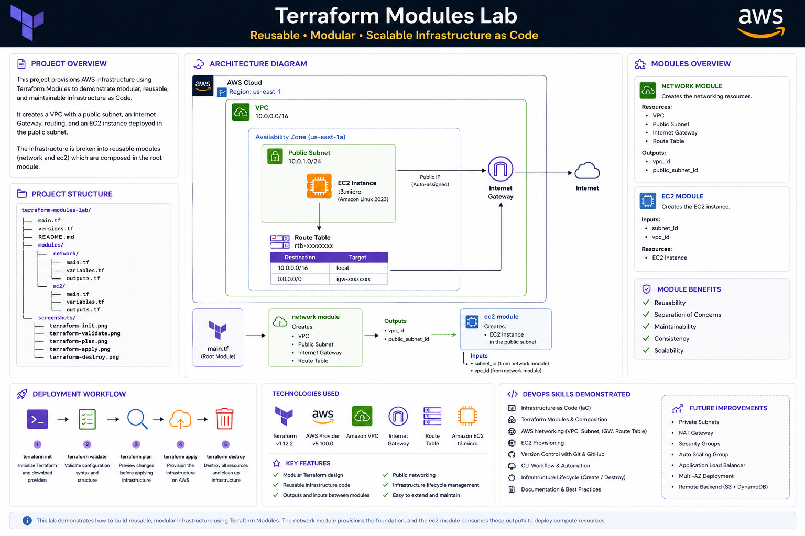

# Terraform Modules Lab

## Project Overview

This project demonstrates how to build reusable Infrastructure as Code using Terraform Modules. Instead of placing all infrastructure in a single configuration, resources are separated into reusable modules that improve scalability, maintainability, and code organization.

# Terraform Modules Lab

Badges (Terraform • AWS • Linux)

---

## Architecture Diagram

  

## Project Structure

(Folder tree)

---

## Architecture Overview

(Brief explanation of each module)

---

## Deployment Workflow

(terraform init → validate → plan → apply → destroy)

---

## Screenshots

(terraform init)

(terraform validate)

(terraform plan)

(terraform apply)

(terraform destroy)

(terraform destroy)

---

## Technologies Used

- Terraform v1.12.2
- AWS Provider v5.100.0
- Amazon VPC
- EC2
- Internet Gateway
- Route Table
- Public Subnet

---

## DevOps Skills Demonstrated

(The list you already created)

---

## Lessons Learned

- Designing reusable modules
- Passing outputs between modules
- Infrastructure lifecycle management
- Using module composition
- Creating maintainable Terraform projects

---

## Future Improvements

- Private subnet
- NAT Gateway
- Auto Scaling
- Load Balancer
- Multi-AZ deployment
- Remote backend integration
